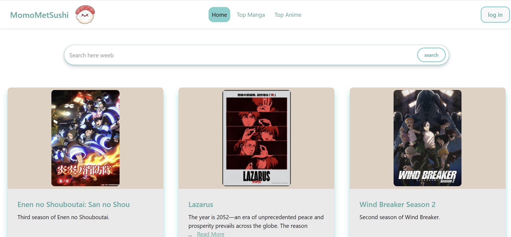
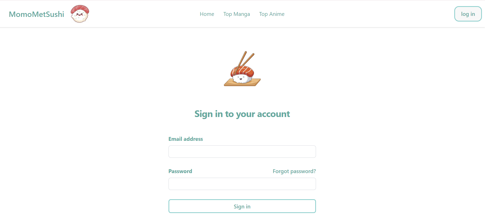
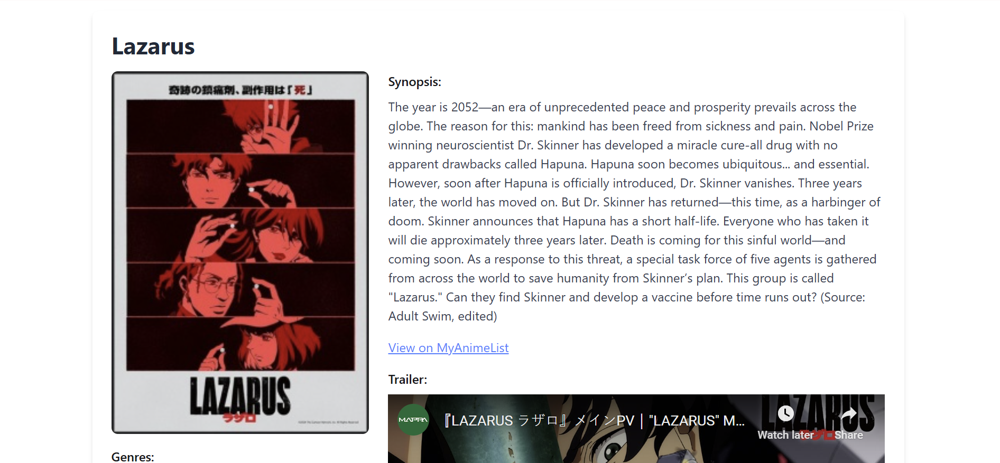

#  WeebSite – Your Anime List Companion

**WeebSite** is a web application inspired by **MyAnimeList**, where users can browse anime details using the [Jikan API](https://jikan.moe/), sign in with Firebase Authentication, and enjoy a clean, modern interface.

> 🌐 **Live Preview**: [weebapp-c488d.web.app](https://weebapp-c488d.web.app/)

---

## ✨ Features

- 🔍 **Search and browse anime** from the Jikan API
- 🔐 **Firebase Authentication** – Email-based sign up & sign in
- 🛡️ **Premium Logic** – Only authenticated users can view detailed anime info
- 🚫 **Protected Routes** – Unauthenticated users are redirected to the login page
- 🎨 **Clean UI** with Tailwind CSS + DaisyUI

---
## 🖼️ Preview

Screenshots of the website 
<p float="left">
  
  
  
</p>

## 🛠️ Tech Stack

- ⚛️ **React**
- 🌀 **Tailwind CSS**
- 🌼 **DaisyUI**
- 🔥 **Firebase Authentication**
- 📡 **Jikan API**

---

## 🚀 Getting Started

```bash
# 1. Clone the repo
git clone https://github.com/AuvroIslam/weebSite.git
cd weebSite

# 2. Install dependencies
npm install

# 3. Start the dev server
npm run dev
